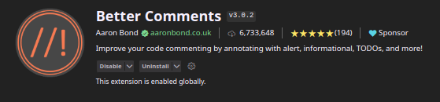

# Before you start to check the project I recommend you to install these apps to your VS code:
###### (maybe you will like it as well)
---
### For improved comment color coding



---

### For cleaner folding of the code


---

# Description

After a sign up you will see the registration page, on this moment you are a guest with no additional information. 
In the registration page you have 2 options for to choose: the customer and airline.
- As a guest you are only able to review the flights information. 
- As a customer you will be able to purchase and cancel the tickets for the flights which will be visible only if there is at least 1 ticket
- As an airline you will be able to add and cancel your flights, in addition you can add the country to the list if one needed

The 4th role is and Administrator. To gain the admin permissions you will need to change the role in the database manually.
Administrator can 
- Choose the customer to edit and buy and cancel the tickets under him
- Choose the airline to edit and add or cancel the flights under it
- View all the active flights

For the pages you have:
- `/` : homepage
- `/dashboard` : your dashboard that will show the data according to your role as was described above
- `/signup`:
- `/login`: will be redirected to `/dashboard` if the user already authenticated 
- `/...` : 404 page if the address was wrong
---
# REST API Routes

This project provides RESTful API routes for managing various resources. Below are the available routes along with their functionalities:

## Routes:

##### Users /api/users/
##### Tickets /api/tickets/
##### Flights /api/flights/
##### Customers /api/customers/
##### Countries /api/countries/
##### Airlines /api/airlines/

#### CRUD operations for above routes:

- `GET /`: Get all records
- `GET /:id`: Get record by ID
- `POST /`: Add a new record
- `PUT /:id`: Rewrite  record by ID
- `PATCH /:id`: Update some fields of record by ID
- `DELETE /:id`: Delete  record by ID

#### Additional routes are related to the table management:

- `POST /table-create`: Create a table
- `POST /table-fill`: Fill the table with values
- `DELETE /table-delete`: Completely delete the table

#### Global services /api/services:
- Complex CURD operations:
  - `GET to /get_active_flights`: to get all the flights that currently in the flight table
  - `GET to /get_customer_flights`: to get all the flights of the authenticated user
  - `GET to /get_chosen_customer_flights/:customerIf`: to get the flights of the chosen by admin customer
  - `POST to /buy_ticket`: to buy a ticket for customer that authenticated or chosen by admin
  - `DELETE to /cancel_ticket`: to delete the ticket by ID
  - `DELETE to /delete_flight`: to delete a flight of airline that authenticated or chosen by admin
  - `GET to /current_user_info`: Get the authenticated user in the following format:

    ```js
    // If user is admin:
    {
        uer:{id, password, email, role},
        airlines:{{name, country, id}}, //all the airlines
        customers:{{id, first_name, last_name, address, phone_number, credit_card, user_id}}// all the customers
    }

    // If user is airline:
    {
        uer:{id, password, email, role}, 
        airline:{name, country, id} // the airline related to the user 
    }

    // If user is customer:
    {
        uer:{id, password, email, role}, 
        customers:{id, first_name, last_name, address, phone_number, credit_card, user_id}// the customer related to the user
    }

    // If user is guest:
    {
        uer:{id, password, email, role}
    }
    ```

- Cookies related operations:
  - `POST to /addAuthCookie` to add auth cookie for the user that logged in /signed up
  - `GET to /getAuthenticatedUser` returns the information of the authenticated user 


- Global tables operation
   - `DELETE to /table_delete_all` to delete all the tables
   - `POST to /init_database` to init the database with proper tables and foreign keys

---
## Tests

- All the dals except of the users Dal covered by the tests
- Part of the services and routs covered by combined tests (routers checked by checking the service within this route)
---
## Folder structure:
```
├── config
├── dals
├── logs
├── routers
├── services
├── tests
├── utils
├── views
│ ├── images
│ ├── includes
│ │ ├─- js
│ │ ├─- style
│ │── ***`pages..`***
├── app.js 
```

---
## Things that probably will be added:

- [ ] Swagger
- [ ] JWT auth
- [ ] Alerts from server to the client
- [ ] 100% test coverage (if one is possible...)
- [ ] Connection flight logic